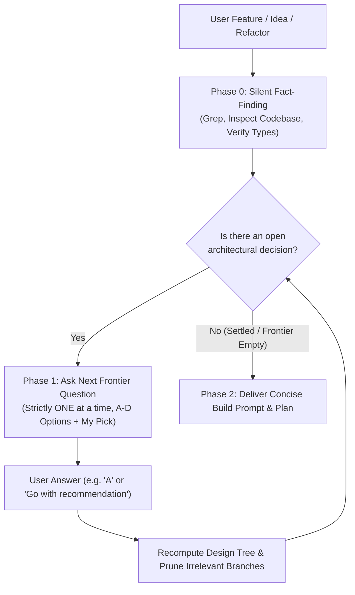

<!--
================================================================================
SKILL SYNTHESIS & DERIVATION METADATA
================================================================================
This skill is a unified synthesis and architectural evolution of two foundational skills:

1. `grilling` (Antigravity Core / Gemini):
   - Autonomous Fact-Finding: AI autonomously inspects the codebase/environment rather than burdening the user with factual questions.
   - Dynamic Decision Tree (Frontier): Models architectural problems as a dependency graph where resolved decisions unlock downstream branches and prune irrelevant ones.
   - Anti-Assumption Rigor: Prevents proceeding on silent assumptions.

2. `ask-then-build` (by David Ondrej):
   - Sequential Low-Cognitive-Load Interaction: Questions are asked strictly ONE AT A TIME with structured A-D options and an explicit agent recommendation ("My pick").
   - Early Termination & Scope Control: Avoids over-questioning; terminates as soon as the core path is clear.
   - Build Prompt Synthesis: Compiles settled decisions into a concise, concrete, actionable implementation prompt/plan for immediate execution.
================================================================================
-->

Turn feature ideas, architectural decisions, or refactoring requests into execution-ready build specifications through autonomous codebase exploration, sequential single-question alignment, and concise prompt compilation.

---

## Workflow Overview

---

## Phase 0 — Silent Fact-Finding (Fact vs. Decision Boundary)

1. **Facts belong to the AI, never the user.** Before asking anything, autonomously inspect the repository using available search and read tools:
   - Identify affected files, exports, interfaces, domain services, database schemas, and existing UI components.
   - Verify architectural rules, design system tokens, and existing patterns.
2. **Never ask the user for facts you can look up yourself.** If a file path, function signature, or configuration can be grepped, find it silently.
3. Formulate questions **only** for genuine business, architectural, or UX decisions where multiple valid tradeoffs exist.

---

## Phase 1 — Sequential Dynamic Alignment (One Question at a Time)

1. Map open decisions as a **dynamic decision tree**. Identify the single most pivotal root decision currently on the **frontier** (decisions whose prerequisites are already settled).
2. Ask strictly **ONE question at a time**. Never bundle multiple questions together, as downstream questions often become obsolete based on the first answer.
3. Use this exact structured layout with a blank line between every block:

   **<Question Title>?**

   <One line of essential context or tradeoff summary, if strictly necessary.>

   A. <First option: concise description + impact>

   B. <Second option: concise description + impact>

   C. <Third option: concise description + impact>

   D. <Fourth option: concise description + impact (or alternative)>

   My pick: <Option Letter>. <One-line crisp rationale grounded in codebase architecture.>

4. Stop and wait for the user's response.
5. **Dynamic Tree Recomputation & Early Exit:**
   - When the user answers (e.g., `"A"`, `"Proceed with recommendation"`, or custom input), immediately update the decision tree.
   - Prune all branches made irrelevant by this answer.
   - If all necessary architectural and functional ambiguities are resolved, **terminate Phase 1 immediately** (typically 1 to 3 questions maximum). Do not ask artificial filler questions.

---

## Phase 2 — Build Prompt & Execution Plan

Once the frontier is resolved and no ambiguities remain, output a single, dense, execution-ready **Build Prompt & Implementation Plan** containing:

1. **Authoritative Context & Read-First Files:** Target files, schemas, and governing rules (`AGENTS.md`, design tokens, service contracts).
2. **Concrete Implementation Steps:** Numbered, file-level changes detailing exact modifications without speculative fluff.
3. **Validation & Verification:** Automated tests, typecheck commands, lint checks, or manual visual validation criteria.
4. **Execution Boundaries:** Strict scope boundaries (e.g., zero regression on existing interfaces, adhere to design system, no unused dependencies).

Seek final user confirmation or proceed directly to execution as dictated by the active mode.
